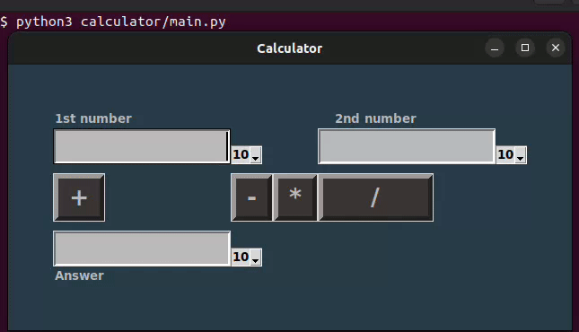

## Задания для практических работ по АДМ группы БПМ-22-1
*Состав:*
* Каневский Даниил
* Труфманов Михаил
* Махров Матвей
---
### Содержание
* [Инструкция по установке](#инструкция-по-установке)
* [Калькулятор](#калькулятор)
* [Комбинаторные схемы](#комбинаторные-схемы)

### Инструкция по установке

- Клонируйте репозиторий, используя команду ниже
```bash
 it clone https://github.com/danyatalent/adm-2024.git
 ```
- Перейдите в директорию adm-2024
```bash
cd adm-2024
```

### [Калькулятор](calculator/main.py)
#### Реализовано
- Ввод данных в позиционной системе счисления (от двоичной по 16-ричную системы счисления)
- Работа с числами с плавающей точкой(**float**)
- Операции сложения, вычитания, умножения, деления 2-х чисел в разных СС

#### Requirements
- python3
- git
- tkinter library

#### Инструкция по тестированию
Следующие команды выполнены, используя bash

- Вызовите python-скрипт

```bash
 python3 main.py
```

#### Пример работы



#### TODO
- Обработка ошибок ввода
- Добавить тесты

---

### Комбинаторные схемы
#### Реализовано
* Консольный интерфейс
* Множественный выбор для 8-ми комбинаторных схем
* Правило суммы
* Правило произведения
* Размещение с повторениями
* Размещения без повторений
* Сочетания с повторениями
* Сочетания без повторений
* Перестановки с повторениями
* Перестановки без повторений

#### Requirements
* python3

#### Инструкция по тестированию
- Вызовите python-скрипт

```bash
python3 comb/test.py
```

#### TODO
* Добавить тесты