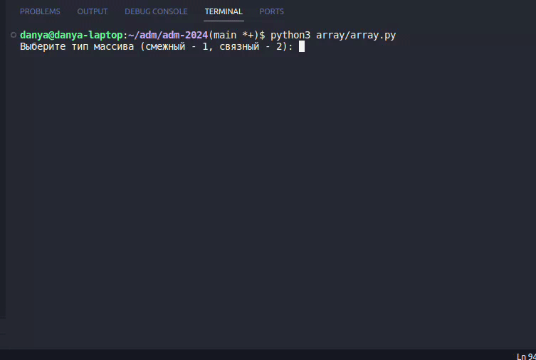

## Задания для практических работ по АДМ группы БПМ-22-1
*Состав:*
* Каневский Даниил
* Труфманов Михаил
* Махров Матвей
---
### Содержание
* [Инструкция по установке](#инструкция-по-установке)
* [Калькулятор](#калькулятор)
* [Комбинаторные схемы](#комбинаторные-схемы)
---
### Инструкция по установке

- Клонируйте репозиторий, используя команду ниже
```bash
 git clone https://github.com/danyatalent/adm-2024.git
```
- Перейдите в директорию adm-2024
```bash
cd adm-2024
```
---
### [Калькулятор](calculator/main.py)
#### Реализовано
- Ввод данных в позиционной системе счисления (от двоичной по 16-ричную системы счисления)
- Работа с числами с плавающей точкой(**float**)
- Операции сложения, вычитания, умножения, деления 2-х чисел в разных СС

#### Requirements
- python3
- git
- tkinter library

#### Инструкция по тестированию
Следующие команды выполнены, используя bash

- Вызовите python-скрипт

```bash
 python3 calculator/main.py
```

#### Пример работы


#### TODO
- Обработка ошибок ввода
- Добавить тесты

---

### [Комбинаторные схемы](comb/test.py)
#### Реализовано
* Консольный интерфейс
* Множественный выбор для 8-ми комбинаторных схем
* Правило суммы
* Правило произведения
* Размещение с повторениями
* Размещения без повторений
* Сочетания с повторениями
* Сочетания без повторений
* Перестановки с повторениями
* Перестановки без повторений

#### Requirements
* python3

#### Инструкция по тестированию
1. Режим тестирования 

```bash
python3 comb/test.py
```

2. Пользовательский режим

```bash
python3 comb/main.py
```

#### Пример работы


---

### [Последовательности](sequence/seq.py)
#### Реализовано
* Коносольный интерфейс
* Смежное представление последовательности
* Связное представление последовательности
* Операции добавления, удаления и другие

#### Requirements
* python3


#### Инструкция по тестированию
```bash
 python3 sequence/seq.py
```


---

### [Массив](array/array.py)
#### Реализовано
* Коносольный интерфейс
* Смежное представление массива
* Связное представление массива
* Операции добавления, удаления и другие

#### Requirements
* python3


#### Инструкция по тестированию
```bash
 python3 array/array.py
```


---

### [Деревья](tree/tree.py)
#### Реализовано
* Коносольный интерфейс
* Смежное представление бинарного дерева
* Связное представление бинарного дерева
* Операции добавления, удаления и другие

#### Requirements
* python3


#### Инструкция по тестированию
```bash
 python3 tree/tree.py
```


### [генерация размещений с повторениями](comb_objects/array_with_rep.py)

#### Каневский Даниил. Вариант 5

#### Реализовано
* Коносольный интерфейс
* Генерация размещений с повторениями

#### Requirements
* python3


#### Инструкция по тестированию
```bash
 python3 comb_objects/array_with_rep.py
```


---

### [Алгоритм поиска с возвращением](maze/maze_main.py)

#### Труфманов Михаил. Вариант 1

#### Реализовано
* Консольный интерфейс
* Генерация шаблона лабиринта
* Процесс нахождения пути в лабиринте с использованием алгоритма поиска с возвращением 

#### Requirements
* python3

#### Инструкция по тестированию
```bash
 python3 maze/maze_main.py
```

---


### [Перестановки с перемещением и без перемещений](permutations/permutations.py)

#### Махров Матвей. Вариант 2

#### Реализовано
* Консольный интерфейс
* Перестановки с перемещением
* Перестановки без перемещений

#### Requirements
* python3

#### Инструкция
С клавиаутуры необходимо ввести количество n чисел, после чего генерируются все перестановки чисел от 1 до n. 


---


### [Сортировка на дереве](tree_sort/tree_sort.py)
#### Реализовано
* Коносольный интерфейс
* Сортировка на дереве
* Блочная сортировка

#### Requirements
* python3


#### Инструкция по тестированию
```bash
 python3 tree_sort/tree_sort.py
```

